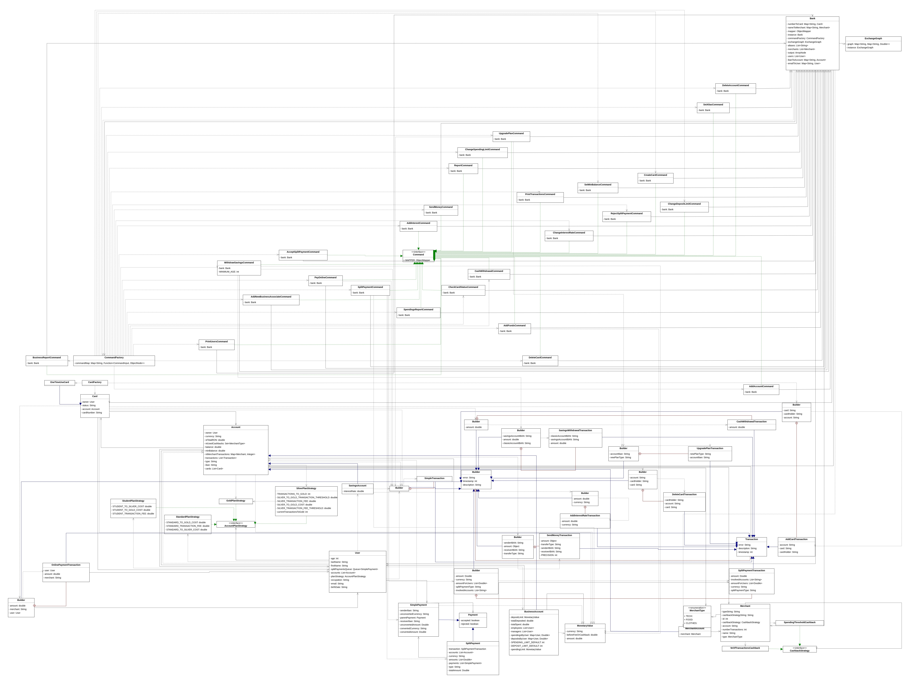

# Banking system

## Table of Contents

- [Introduction](#introduction)
- [Functionality](#functionality)
- [Relations between Classes](#relations-between-classes)
  - [Bank (Aggregator and Orchestrator)](#bank-aggregator-and-orchestrator)
  - [Users and Accounts: Composition](#users-and-accounts-composition)
  - [Accounts and Transactions: Composition](#accounts-and-transactions-composition)
  - [Accounts and Cards: Composition](#accounts-and-cards-composition)
  - [Commands and CommandFactory](#commands-and-commandfactory)
- [Class Summaries](#class-summaries)
  - [Bank (Singleton)](#bank-singleton)
  - [User (Factory)](#user-factory)
  - [Account](#account)
  - [Command (Interface) (Factory & Command)](#command-interface-factory--command)
  - [Transaction (Builder)](#transaction-builder)
  - [Card (Factory)](#card-factory)
  - [ExchangeGraph (Singleton)](#exchangegraph-singleton)
  - [Merchant (Uses Strategy Design Pattern for Cashback)](#merchant-uses-strategy-design-pattern-for-cashback)
  - [Other Helper Classes (`Report`, `SpendingsReport`, `ResponseOutput`, `Utils`)](#other-helper-classes-report-spendingsreport-responseoutput-utils)
- [Notes](#notes)
  - [Total Design Patterns used](#total-design-patterns-used-5-singleton-factory-command-strategy-builder)
  - [Shortcomings](#shortcomings)
  - [What I could have done better](#what-i-could-have-done-better)

## Functionality

The banking system serves as a financial simulation platform, supporting account operations and transaction processing.
At its core, the `Bank` acts as a central *aggregator* of entities such as `User`, `Account`, `Merchant`.
It also provides the infrastructure for executing business logic encapsulated in `Command` objects via a `CommandFactory`.

The bank processes commands sequentially by fetching and executing them from a command queue (in this case, just a simple list).
This approach simplifies processing but limits scalability in a real-world, multithreaded environment.
After processing, commands produce outputs specific to their operations, such as Reports, Transactions, Errors, etc.

## Relations between Classes

This is the UML diagram for the classes in the project (excluding the helper classes):

The diagram shows the relationships between the classes in the system, highlighting the composition and aggregation
relationships between entities.

Here are some key relationships between classes:

### Bank (Aggregator and Orchestrator)
The `Bank` class *aggregates* several key components of the system, including: Users, Accounts, Merchant Categories.
It also interacts directly with `Command` objects to execute different operations.
The *composition* relationship between `Bank` and entities like `User`, `Merchant`, reflects the bank's
ownership and lifecycle control over these objects (I know, very philosophical).
For instance:
- A `User` cannot exist without the `Bank`, as users are created and managed by the bank.
- Accounts are similarly owned by the bank, making their lifecycles dependent on the bank.

### Users and Accounts: Composition
A `User` is composed of one or more `Account` objects, demonstrating a strong ownership relationship.
This is implemented as a list of accounts within the `User` class.
The accounts are further specialized into `SavingsAccount`, `BusinessAccount` and `MerchantAccount` using inheritance (`extends`), enabling different types of account behavior (e.g., interest rates for savings accounts, employees and business reports for business accounts).
The user’s association with accounts allows them to perform transactions, where each account's state (balance, currency, transactions) is affected.

In the `User` class, the `createAccount` method acts as a factory method for creating different types of accounts.
This method encapsulates the account creation logic, ensuring that the bank can manage the account creation process consistently.

The `BusinessAccount` class is a subclass of `Account` that adds functionality specific to business accounts, such as managing employees and generating reports.
It associates a `Merchant` object with the account, representing the business entity that owns the account.
It also associates lists of `Employee`, `Manager` objects with the account, representing the associates who have access to the account.
This class demonstrates the use of inheritance to extend the behavior of the base `Account` class.

### Accounts and Transactions: Composition
An `Account` is composed of one or more `Transaction` objects which have the exact same life-time.

### Accounts and Cards: Composition
The `Account` class is composed of one or more `Card` objects, representing (online) payment instruments.
Cards are further specialized into `NormalCard` and `OneTimeUseCard` using inheritance:
- `NormalCard`: represents standard cards for regular transactions.
- `OneTimeUseCard`: models disposable cards with a one time use; after the use, it regenerates.

### Commands and CommandFactory
The `Command` interface defines the structure for all operations executable by the bank.
Each specific command (e.g. `AddAccountCommand`, `SendMoneyCommand`) implements the `Command` interface, ensuring consistency.

The `CommandFactory` is the mediator.
It uses a mapping (`commandMap`) to associate command names with their implementations.

This **factory** pattern enables extensibility and dynamic behavior.
The `Bank` "**delegates**" command execution to the factory, promoting separation of concerns.

## Class Summaries

### Bank (Singleton)
The central hub for all operations, managing users, accounts, transactions, and commands but also works as a "database" in this case (mapping emails to `User`s, IBANs to `Account`s).
It interacts with the command system to execute various actions.
- **Why Singleton?** Because we want to have a single instance of the bank in the system and to be able to access it from anywhere in the system.

### User (Factory)
Represents a user in the system, who owns multiple accounts and performs actions such as creating accounts, adding/deleting cards, transfering currency, and doing online payments.
It ensures that accounts are properly associated with the user and enforces user-specific security constraints during these operations.

It acts as an `Account` **factory**, and it works based on the type of the `Account` needed.
It also acts as a mediator with a `Card` **factory**, and it works based on the type of the `Card` needed.

### Account
Represents a general abstract account containing attributes and operations for managing a user's financial account, such as handling funds, cards, and transactions.
The class is designed to be extended by specific account types, such as savings accounts, business accounts, or merchant accounts.
It now has a `planStrategy` field that is a functional interface that can be implemented by different strategies for the account plan.
- The `planStrategy` is actually global for all owner's accounts.
- The `planStrategy` is used to calculate the fee for a savings account.
- **Why Strategy?**: Because we want to be able to change the plan strategy at runtime and do minimal changes to the code.
  Adding a new plan strategy is easy and doesn't require changes to the existing code.

### Command (Interface) (Factory & Command)
Implementations of this interface define specific command behaviors and  logic that interact with various components of the bank system.
Each specific command implementations has a detailed description in its class.
- **Why Factory?**: Because we want to be able to create different types of commands without exposing the instantiation logic to the client.
  Also, this way, we can add new commands without changing the existing code, just by adding a new class and a new registry entry in the `Command.Factory.commandMap`.
- **Why Command?**: Because we want to be able to add new functionalities without breaking the existing code.
  This way, we can encapsulate the request as an object and pass it to the bank to execute it.
  This way, we can also undo the operations if needed (not implemented in this case).

### Transaction (Builder)
This class is designed to be extended for multiple types of transactions such as money transfers, card payments, and split payments.
Each transaction can have specific details such as sender/receiver information, currency, and other metadata.
- It uses the **Builder** design pattern (the real one, unlike the one implemented in phase 1).
  **Why?**: For serialization is a great feature especially when we have a lot of parameters to set and we want to make the code more readable.

### Card (Factory)
Tied to the accounts, extends to standard cards and disposable cards which regenerate after use.
Can be checked and be frozen when the balance is between minimum balance set to the account.

Both types of cards have the capability to withdraw money from the account via online payments.

- **Why Factory?**: Because we want to be able to create different types of cards without exposing the instantiation logic to the client.
  Also, this way, we can add new cards without changing the existing code, just by adding a new class and a new registry entry in the `CardFactory`.

### ExchangeGraph (Singleton)
Stores known exchange rates between currencies to facilitate conversions.
To convert a currency, the implementation uses a `DFS` traversal to find the "rate path" to the desired currency.

**Why Singleton?**: Because we want to have a single instance of the exchange graph in the system and to be able to access it from anywhere in the system so that we can convert currencies (e.g. used by `MonetaryValue` to convert itself).

### Merchant (Uses Strategy Design Pattern for Cashback)
Represents a business entity that can own a business account.
It has a name, a category, and a `cashBackStrategy`.
  - The `cashBackStrategy` is an interface that can be implemented by different strategies for cashback rewards.
  - The `cashBackStrategy` is used to calculate the cashback amount for a transaction.
  - **Why Strategy?**: Because we want to be able to change the cashback strategy at runtime and do minimal changes to the code.
It can be associated with a business account and can be used to generate reports.

### Other Helper Classes (`Report`, `SpendingsReport`, `ResponseOutput`, `Utils`)
- These are mainly used for output formatting.

## Notes

### Total Design Patterns used: 5 (Singleton, Factory, Command, Strategy, Builder)

- **Singleton**: `Bank`, `ExchangeGraph`
- **Factory**: `Account`, `Command`, `Card`
- **Command**: `Command`
- **Strategy**: `AccountPlanStrategy`, `CashBackStrategy`
- **Builder**: `Transaction`

**<ins>NOTE:</ins>** I've mentioned the motivation for using each design pattern in the class summaries.

### Shortcomings

- The system processes commands sequentially, which is a bottleneck for real-world applications where concurrency is 
  essential.

### What I could have done better

- Find a better way to generate `Report`s and `ObjectNode`s to avoid code duplication.
- Implement a better way to handle the exchange rates.
  I was going to try to implement a way for the currency to be able to convert itself, but I didn't have time to do it entirely.
  For now, the `MonetaryValue` class uses the `ExchangeGraph` to convert itself, but still needs to be interacted with in many places.
- Some inconsistencies here and there but nothing major. Didn't have time to fix them all.
- Maybe shorten the README (at this moment, it's somewhere around 120 lines wihout the table of contents and whitespace).
